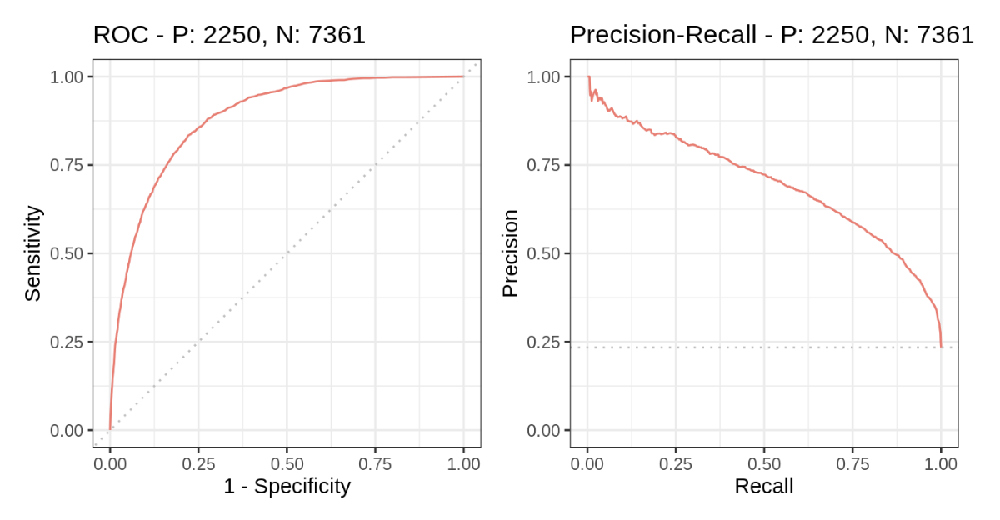

m6APrediction: A Machine Learning Predictor for m6A RNA Modification Sites

💡 Overview

The m6APrediction package provides a robust, pre-trained Random Forest model for predicting the N6-methyladenosine (m6A) modification status at specific RNA sites. This tool leverages multiple genomic and sequence-based features to offer high-confidence predictions (probability and status: Positive/Negative).

🚀 Installation Guide

This package is designed to be installed directly from GitHub using the remotes package.

First, ensure you have the necessary dependencies installed:

install.packages(c("devtools", "randomForest", "remotes"))

Next, install the m6APrediction package from the repository :

remotes::install_github("coasir/m6APrediction")

🛠️ Minimal Usage Example

Once installed and loaded, you can use the exported functions to predict m6A status for single or multiple sites.

Step 1: Load Package and Data

The package includes an example input dataset (m6A_input_example.csv) for quick testing.

# Load the package
library(m6APrediction)

# Locate the example data file bundled within the package
input_file_path <- system.file("extdata", "m6A_input_example.csv", package = "m6APrediction")

# Read the data
feature_df_test <- read.csv(input_file_path, stringsAsFactors = FALSE)

Step 2: Predict Multiple Samples

Use prediction_multiple for batch prediction:

# The model 'ml_fit' is loaded when the package loads
prediction_result <- prediction_multiple(
  ml_fit = m6APrediction::ml_fit, # Access the loaded model
  feature_df = feature_df_test[1:5, ], # Use first 5 rows for brevity
  positive_threshold = 0.5
)

head(prediction_result)

Step 3: Predict a Single Sample

Use prediction_single for individual site prediction:

single_sample <- feature_df_test[1, ]

single_prediction_result <- prediction_single(
  ml_fit = m6APrediction::ml_fit, 
  gc_content = single_sample$gc_content,
  RNA_type = single_sample$RNA_type,
  RNA_region = single_sample$RNA_region,
  exon_length = single_sample$exon_length,
  distance_to_junction = single_sample$distance_to_junction,
  evolutionary_conservation = single_sample$evolutionary_conservation,
  DNA_5mer = single_sample$DNA_5mer
)

print(single_prediction_result)

📈 Model Performance Visualization

